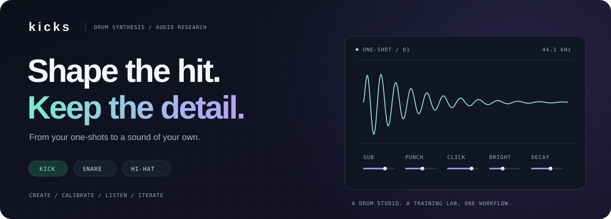
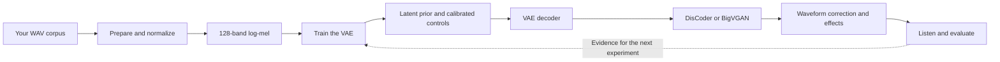

<p align="center">
  
</p>

<p align="center">
  <strong>Train on your one-shots. Shape new drums. Hear what changed.</strong><br>
  A generative drum studio for kicks, snares and hi-hats, with a training lab built in.
</p>

<p align="center">
  <a href="#start-making-sounds">Quick start</a> ·
  <a href="#open-the-studio">Studio</a> ·
  <a href="#train-with-a-clear-direction">Training lab</a> ·
  <a href="#listen-measure-then-promote">Fidelity</a> ·
  <a href="#under-the-hood">Architecture</a> ·
  <a href="#reference-desk">Reference</a>
</p>

---

## One project. Two places to work.

| **The studio** | **The training lab** |
|:---|:---|
| Shape drums with calibrated **Sub, Punch, Click, Bright and Decay** controls, or the snare and hi-hat equivalents. | Follow every experiment through **live KPIs, comparison charts, notes and attached evidence**. |
| Play a **4 × 4 pad bank** from your keyboard, pointer or MIDI controller. Build and save kits. | Test **HF detail losses, residual blocks and latent skip connections** against a recorded baseline. |
| Explore waveforms, spectrograms and corpus analytics. Export **24-bit WAVs** through the account credit system. | Compare rendered audio in **blind listening pairs**, audit slider response and record promotion decisions. |

The sound engine is a convolutional **variational autoencoder (VAE)**: it learns
from your samples and decodes new sounds from a compact latent representation.
DisCoder or BigVGAN turns the decoded spectrogram into audio. Calibrated controls
then correct the rendered waveform toward the requested descriptors.

### Three instruments, one engine

| Instrument | Shape it with | Corpus | Default vocoder | Served checkpoint |
|:---|:---|:---|:---|:---|
| **Kick** | Sub · Punch · Click · Bright · Decay | `data/kicks/` | DisCoder | `models/vae_best.pth` |
| **Snare** | Body · Crack · Snap · Bright · Decay | `data/snares/` | DisCoder | `models/snare/vae_best.pth` |
| **Hi-hat** | Attack · Body · Sizzle · Bright · Decay | `data/hihats/` | BigVGAN | `models/hihat/vae_best.pth` |

Instrument-aware commands accept `--instrument` / `-i`. Profiles supply the
slider definitions, audio windows, evaluation rules and paths; the pipeline is shared.

## Start making sounds

**You need:** Python 3.10+, [uv](https://docs.astral.sh/uv/), and your `.wav`
one-shots. For the website, use Node 22+ and pnpm. The engine selects CUDA,
Apple Silicon MPS, then CPU according to availability.

### Set up the engine

```bash
uv sync
uv run kicks instruments
```

Place samples in the corpus directories above. Loading converts them to
44.1 kHz mono, fits their length and applies peak-safe loudness normalization.
Corpora and trained VAE weights are local assets; they are not included in Git.

**Already have a trained checkpoint?** Continue below. Otherwise, follow
[Train with a clear direction](#train-with-a-clear-direction), evaluate the
candidate and promote it before serving.

### Start the API

```bash
uv run kicks serve                 # http://localhost:8080
```

One server loads trained instruments as needed. The first DisCoder load
downloads about **1.72 GB** of weights; later loads reuse the local copy.

<details>
<summary><strong>Choose a different vocoder or control mode</strong></summary>

```bash
uv run kicks serve --vocoder bigvgan   # Force BigVGAN for all instruments
uv run kicks serve --griffin-lim       # Classical reconstruction; no vocoder weights
uv run kicks serve --control pca       # Explore principal-component controls
```

Griffin-Lim still needs a trained VAE. It is useful for checking the pipeline;
the neural vocoders are the fidelity path.

DisCoder uses the pinned official 44.1 kHz Z checkpoint and its fine-tuned DAC
decoder. It shares the existing 128-band mel contract, so switching between
DisCoder and BigVGAN does not itself require VAE retraining. Their defaults
come from per-instrument audits: kicks and snares use DisCoder; hi-hats retain
BigVGAN. Those audit scores describe corpus likeness and control behavior,
not a listening-quality certification.

Weights live in `models/discoder/` by default. `KICKS_DISCODER_DIR` overrides
that location; `KICKS_VOCODER` overrides every profile's backend. BigVGAN also
loads local fine-tuned weights from the profile's `vocoder_dir`.

</details>

### Open the studio

In another terminal:

```bash
cd web
cp .env.example .env.local
pnpm install
pnpm dev                           # http://localhost:3000/studio/
```

The example environment points at the local API. Accounts are optional for
local development; billed exports require the Supabase setup described below.

| Open | What you will find |
|:---|:---|
| **[Studio](http://localhost:3000/studio/)** | Instrument controls, envelope/drive/filter effects, waveform and spectrogram views, realism checks, MIDI pads and kits |
| **[Analysis](http://localhost:3000/analysis/)** | Interactive 3D corpus atlas, sound-family profiles and audio, clustering evidence and linked sample inspection |
| **[Training dashboard](http://127.0.0.1:6060/)** | Live experiments and their notebooks; start with `uv run kicks dashboard` |
| **[API docs](http://localhost:8080/docs)** | Interactive FastAPI endpoint reference |

## Train with a clear direction

**Baseline → experiment → listen → audit → decide.**

The [fidelity and training plan](docs/high-fidelity-generation.md) connects the
audio work to its evidence. Loss and architecture experiments are implemented;
a codec-latent sequence generator remains a future step if the measured VAE
ceiling is insufficient.

### Prepare a clean corpus

```bash
uv run kicks strip --dry-run        # Inspect proposed trims
uv run kicks strip                  # Isolate hits; backs up originals
uv run kicks clean                  # Inspect quarantine decisions
uv run kicks clean --apply          # Move rejected hits, with a manifest
```

Use `-i snare` or `-i hihat` for their own onset and decay rules. Stripping backs
up the corpus by default; cleaning quarantines samples instead of deleting them.

<details>
<summary><strong>Optional corpus expansion: Drum Abuse packs</strong></summary>

```bash
uv run python scripts/fetch_drum_abuse.py snare
uv run python scripts/fetch_drum_abuse.py hihat
```

The harvester downloads indexed one-shots, deduplicates by content hash and
stages them under `data/_staging/snares/abuse/` or
`data/_staging/hihats/abuse/`. Review and validate staged audio before merging it
into a training corpus. `kick` and `all` are also supported.

</details>

### Give the experiment a notebook

Start the viewer **before training**:

```bash
uv run kicks dashboard             # http://127.0.0.1:6060
```

Then train in a separate terminal. This example creates a new baseline in an
isolated model directory:

```bash
uv run kicks train -i kick --epochs 200 --preview 0 \
  --model-dir models/experiments/baseline \
  --run-name "Kick · baseline" \
  --intent "Preserve attack definition and natural high-frequency decay" \
  --hypothesis "The baseline will reveal where reconstruction loses detail" \
  --success-criteria "Record HF errors, blind listening results and slider target errors"
```

`--preview 0` skips automatic post-training audio previews; the fidelity command
below renders the comparison set. For snares and hi-hats, `--model-dir` remains
a **root**: their checkpoints go in its `snare/` or `hihat/` subdirectory.
Shared vocoder weights stay in the original model root, so a new experiment
directory does not trigger another DisCoder download. Explicit vocoder-directory
environment settings still take precedence.

| When | Notebook field | Write down |
|:---|:---|:---|
| **Before** | Objective · `--intent` | The audible problem you want to solve |
| **Before** | Hypothesis · `--hypothesis` | The isolated change and why it might help |
| **Before** | Success criteria · `--success-criteria` | The measurements and listening thresholds that decide success |
| **During** | Observations | Epoch references, trends, listening findings and report paths |
| **After** | Decision & next action | Continue, reject or promote, with the supporting evidence |

### Watch the detail, not just the loss

The dashboard refreshes every three seconds and includes **exact-value hover,
optional smoothing, epoch ranges, two-run comparisons, JSON export and editable
notes**. Its Evidence card collects fidelity, controls and promotion reports.

| Signal | What it tells you |
|:---|:---|
| **Validation loss + loss components** | Reconstruction under a fixed beta and posterior-mean decoding, including the unweighted experimental terms |
| **2–16 kHz / 8–16 kHz / attack error** | Detail retained in active reference mel bins, **before the vocoder** |
| **Active dimensions + raw KL** | How much of the latent representation carries information |
| **Learning rate, beta, duration** | The training schedule and time spent |
| **Generative proxy** | Descriptor-distribution mismatch for sampled sounds; it is not a listening score |

> [!NOTE]
> Training and validation use different posterior/beta conventions. Compare
> absolute losses across runs only when data, split and objective match.
> Pre-vocoder mel errors and post-vocoder waveform errors are different metrics.

<details>
<summary><strong>Run files, checkpoint selection and recovery</strong></summary>

Every training-loop invocation creates `output/training/<run-id>/` with
`run.json`, `notes.json`, a standalone `index.html` and sibling data scripts.
Attached evidence is stored separately in `reports.json` / `reports.js`.
Open the HTML directly for a live read-only view; use the HTTP viewer to edit
notes and compare runs. No CDN or account is needed.

The logger records an epoch-zero baseline, live progress, epoch measurements,
configuration, a data/split fingerprint and terminal status. It starts **after
corpus loading**. An already running process cannot gain hooks retroactively;
a hard kill can leave a stale `running` record. Unavailable measurements stay empty.

| Checkpoint | Selection rule |
|:---|:---|
| `vae_best.pth` | Lowest fixed-objective validation loss; a fine-tune preserves the source baseline if no epoch improves it |
| `vae_best_eval.pth` | Best periodically measured generative descriptor proxy |
| `vae_checkpoint.pth` | Final training state |

These selection rules do not establish final audio quality. Evaluate the exact
candidate you intend to serve.

Set `--runs-dir` or `KICKS_RUNS_DIR` to move the shared records root, and point
the viewer at the same directory. `uv run kicks dashboard --port 6061` selects
a different viewer port.

</details>

### Try one change at a time

| Experiment | Options | Meaning |
|:---|:---|:---|
| **HF detail** | `--hf-detail-weight` | Symmetric reconstruction of audible reference detail across the hit |
| **Attack shape** | `--attack-change-weight` | Match frame-to-frame changes during the click window |
| **Residual blocks** | `--residual` | Add identity-initialized residual blocks to the convolutional network |
| **Latent skips** | `--latent-skips` | Inject the latent through learned scale/shift operations at decoder feature scales |
| **KL behavior** | `--soft-logvar`, `--beta-floor` | Test a smooth variance bound and keep a minimum KL weight during annealing |
| **Screening schedule** | `--beta-anneal-epochs` | Keep a longer beta schedule while running a shorter initial experiment |
| **Capacity / compression** | `--latent-dim`, `--beta`, `--free-bits` | Test how much information the model retains |

The extra loss weights and beta floor default to **zero**; residual blocks,
latent skips and soft log-variance default to **off**. A resumed checkpoint keeps
its own architecture, so `--resume` cannot be combined with `--residual`,
`--latent-skips` or `--soft-logvar`.

<details>
<summary><strong>Example: fine-tune a checkpoint with HF detail loss</strong></summary>

These are experiment settings, not calibrated winning weights. Compare against
a run with the same source checkpoint, split and schedule and the extra loss disabled.

```bash
uv run kicks train -i kick \
  --resume models/vae_best.pth \
  --model-dir models/experiments/hf-detail \
  --epochs 12 --learning-rate 0.00003 --beta 0.001 --preview 0 \
  --hf-detail-weight 0.5 \
  --run-name "Kick · HF detail ablation" \
  --intent "Retain high-frequency texture through the VAE" \
  --hypothesis "Symmetric HF reconstruction will reduce missing detail" \
  --success-criteria "Beat the matched baseline on HF error and blind listening without control regression"
```

For an architecture comparison, create a new model with `--residual` and/or
`--latent-skips`, and compare it with a new baseline of the same latent size.
The [full plan](docs/high-fidelity-generation.md) describes the sequence.

</details>

<details>
<summary><strong>Keep KL learning during a short screening run</strong></summary>

`--soft-logvar` replaces hard clipping of the encoder's log variance with a
smooth bound. `--beta-floor 0.1` keeps the KL weight at least 10% of the target
beta during annealing; with `--beta 0.02`, that means a minimum of `0.002`.
These are optional experiments, not automatic quality improvements.

For example, `--epochs 20 --beta-anneal-epochs 200` uses the first 20 epochs of
the longer **beta** schedule. The cosine **learning-rate** schedule still spans
20 epochs, so this is not an identical prefix of a 200-epoch training run.
Fine-tuning with `--resume` uses fixed beta instead of annealing.

</details>

## Listen, measure, then promote

A lower training curve is useful evidence. The final decision also needs audio.

### 01 · Render a matched comparison

Replace `YOUR_RUN_ID` with the ID printed by training or a unique prefix:

```bash
uv run kicks fidelity -i kick \
  --run YOUR_RUN_ID \
  --checkpoint models/experiments/hf-detail/vae_best.pth \
  --out output/audits/hf-detail
```

The report compares **reference audio → real mel through the vocoder → VAE
reconstruction through the vocoder**. It measures level-matched 2–8 kHz and
8–16 kHz attack/body error, onset timing, envelope, flatness and late energy.
Fresh prior samples get corpus-referenced realism scores as well.

Open `output/audits/hf-detail/listening/listening.html` for randomized,
level-matched **whole-hit and 2 kHz+ A/B pairs**. Record the listening tally and
findings in the notebook; the tally page does not save them automatically.
The full report is `report.json`, and its summary attaches to the run.

<details>
<summary><strong>Which samples are held out? New runs and older checkpoints</strong></summary>

With `--run`, fidelity reproduces the recorded validation split only when the
corpus still matches its fingerprint. If it cannot, it prints a warning and
samples the **whole corpus**. Check `held_out`, `hit_origin` and `hits` in the
report before describing results as held-out evidence.

For a checkpoint trained before tracking existed:

```bash
uv run kicks fidelity -i kick --checkpoint models/vae_best.pth \
  --split-seed 42 --val-split 0.1 \
  --seed 20260916 --out output/audits/legacy-baseline
```

`--split-seed` and `--val-split` must match the original training run, and the
corpus and its ordering must be unchanged. There is no historical fingerprint
check in this mode. `--seed` separately controls sample selection and blind-pair
ordering. When `--run` is supplied, its saved split settings take precedence.
Without either split source, fidelity samples the whole corpus.

</details>

### 02 · Audit the controls

```bash
uv run python scripts/validate_controls.py --instrument kick \
  --run YOUR_RUN_ID \
  --checkpoint models/experiments/hf-detail/vae_best.pth \
  --corners --random 32 --out output/audits/hf-detail-controls
```

The audit exercises axes, corners and independent random slider combinations
on rendered audio, reporting target error, cross-talk, corpus realism and timing.
It attaches a controls summary to the same run.

Slider independence means matching the defined descriptors within calibrated
ranges. It does not guarantee that all listeners perceive every sound attribute
as independent. Envelope, drive and filter effects intentionally change the result.

### 03 · Record the decision

After reviewing the measurements and listening results, write the decision in
the notebook. Then promote the evaluated candidate:

```bash
uv run kicks promote -i kick --run YOUR_RUN_ID \
  --checkpoint models/experiments/hf-detail/vae_best.pth
```

Promotion requires a written decision and attached fidelity and controls reports.
It copies the candidate to the served path, keeps `vae_best_prev.pth`, carries
an available `.controls.npz` sidecar and records the checkpoint SHA-256.
**Restart the API after promotion** to load the new weights.

The gate checks that evidence is attached; it does not judge report quality or
verify that every report belongs to the candidate bytes. Check those identities
and results yourself. `--allow-missing-evidence` is an explicit, recorded bypass.

## Under the hood



The default VAE has four convolutional stages, a 32-dimensional latent vector
and a mirrored decoder. Checkpoints record their actual dimensions and optional
architecture. The base loss combines pooled mel reconstruction, beta-weighted
KL with free bits and instrument-specific transient penalties. The optional HF
and attack terms extend that objective; waveform evaluation is a separate step.

<details>
<summary><strong>Signal contract and control calibration</strong></summary>

- **Audio:** 44,100 Hz; default length 65,536 samples.
- **Mel:** FFT 1,024, hop 256, 128 bands × 256 frames; fixed log bounds
  `[-11.5129, 3.0]` mapped to `[0, 1]`.
- **Latents:** a Gaussian-mixture prior is fitted to corpus encodings for batch
  generation; best-of-*k* selection uses corpus-referenced evaluation.
- **Controls:** the default descriptor basis solves for target measurements,
  followed by waveform correction to reduce vocoder drift. Snare and hi-hat
  controls retain a corpus texture, use median-centered percentile travel, and
  cap correction at ±6 dB. Extreme combinations can remain coupled; the studio
  reports this in its corpus comparison. **New variation** changes the texture
  while retaining settings, and pads preserve that variation. PCA controls remain available.
- **Calibration:** `<checkpoint-stem>.controls.npz` stores the basis and ranges.
  Corpus-anchored controls use a separate `.identity.npz` cache. Checkpoint,
  profile, corpus or calibration-version changes invalidate the corresponding cache.
  See the [identity plan and measured results](docs/audio-identity-plan.md).
- **Profiles:** adding an instrument starts in `kicks/instruments/`; descriptors,
  windows, metrics and vocoder choice belong there.

</details>

## Reference desk

<details>
<summary><strong>CLI essentials and corpus analytics</strong></summary>

```bash
uv run kicks generate -n 20 -k 8    # Batch generation; best of 8 per output
uv run kicks eval                  # Compare generated output to the corpus
uv run kicks sweep -n 40           # Exercise the running API's slider space
uv run kicks cluster -i kick       # Corpus clustering and averaged cluster audio
uv run kicks cluster -i snare
uv run kicks cluster -i hihat
uv run kicks publish-analysis      # Publish browser-safe reports to web/public/analysis/
uv run kicks --help
```

Published analysis removes corpus filenames and paths. Keep full local fidelity
reports private: those contain source paths and the selected hit filenames.

The corpus atlas connects an overview, rotatable 3D / orthographic 2D projections,
sound-family profiles, descriptor distributions, and a searchable sample table.
Switch between standardized descriptor PCA and latent PCA; the page shows the
variance retained by each view. Family selection links the map, distributions
and table, and the uncertainty filter exposes membership probabilities below 80%.
Descriptor charts use native dB/ms units; family profiles compare means in standard
deviations, with names derived from the largest measured differences.

Clustering removes constant latent dimensions, standardizes the remainder and
retains at least 95% of their variance with PCA. BIC compares 1–16 mixture
components with full and diagonal covariance, three seeded initializations and
covariance regularization. The winning converged fit is reused. Reports include
candidate scores, sampled silhouette, uncertainty, projection coverage and a
search-boundary flag. These describe the fitted model, not validated musical
categories. Family IDs are ordered by population within each report and may
change when the corpus or model changes. Averaged audio is phase-sensitive and
can differ from a typical individual member.

</details>

<details>
<summary><strong>Waveform diffusion — an experiment, not a second engine</strong></summary>

An alternative backend generates audio directly: a descriptor-conditioned 1-D
U-Net denoises a waveform, with no VAE and no vocoder in the path. **It has
never been trained.** The code, the commands and the tests exist so the
experiment can be run; no checkpoint, benchmark or listening evidence does, and
nothing in the API or the studio uses it.

```bash
uv run kicks diffusion-train -i kick --model-dir models/experiments/diffusion \
  --run-name "Kick · waveform diffusion baseline" --intent "..." \
  --hypothesis "..." --success-criteria "..."
uv run kicks diffusion-generate -i kick -n 8 --steps 50 --target punch=9
```

Runs land in the same dashboard as VAE runs. `--seed` is the texture seed and
`--target` pins a slider, so one can be held while the other moves.
`docs/waveform-diffusion.md` has the design, the decisions behind it and the
full list of what has not been measured.

</details>

<details>
<summary><strong>REST API</strong></summary>

Base URL: `http://localhost:8080`. Synthesis requests accept `instrument`.

| Endpoint | Response |
|:---|:---|
| `GET /health` | Device, vocoders, loaded instruments, control basis and auth mode |
| `GET /instruments` | Registered instruments and trained status |
| `GET /config` | Slider configuration for an instrument |
| `GET /generate` | Cached preview WAV |
| `GET /evaluate` | Waveform verdicts and descriptors for the same settings |
| `GET /spectrogram` | Decoded mel before vocoding |
| `GET /me` | Signed-in user and credit balance |
| `POST /export` | 24-bit WAV; one credit, with an `Idempotency-Key` header for retries |

```bash
curl "http://localhost:8080/generate?instrument=kick&click=0.8&sub=0.3" -o kick.wav
curl "http://localhost:8080/evaluate?instrument=snare&crack=0.9"
```

Slider parameters accept `s1..sN`, legacy `pc1..pcN` or the exposed slider label;
omitted values default to the center. Effects use `attack_ms`, `decay_ms`,
`drive` and `filter`. Snare/hi-hat requests also accept an integer `seed` in
`[0, 4294967295]` (default `0`) for reproducible texture selection; `/config`
advertises support with `variation: true`. Preview, evaluation, spectrogram and
export share that seed. Synthesis is limited by a shared 10 requests/second token
bucket and uses a 100-entry LRU cache.

Without Supabase the local API is open and billed export is unavailable.
When configured, synthesis expects a Supabase bearer token by default;
`KICKS_AUTH_MODE=optional` permits anonymous previews. `/me` and `/export`
require an authenticated user.

</details>

<details>
<summary><strong>Environment variables</strong></summary>

| Variable | Default / purpose |
|:---|:---|
| `KICKS_INSTRUMENT` | `kick` |
| `KICKS_DATA_DIR` | `data` — corpus root |
| `KICKS_MODEL_DIR` | `models` — model root; profile subdirectories still apply |
| `KICKS_OUTPUT_DIR` | `output` — outputs root |
| `KICKS_RUNS_DIR` | `<KICKS_OUTPUT_DIR>/training` — shared training records |
| `KICKS_VOCODER` | Unset — use each profile; override with `discoder`, `bigvgan` or `griffinlim` |
| `KICKS_DISCODER_DIR` | `<KICKS_MODEL_DIR>/discoder` — DisCoder weights; pinned to the original root by `train --model-dir` |
| `KICKS_VOCODER_DIR` | Profile model directory + `vocoder/` — BigVGAN weights; pinned to the original root’s `vocoder/` by `train --model-dir` |
| `KICKS_CONTROL` | `descriptor`; alternative `pca` |
| `KICKS_CORS_ORIGINS` | `http://localhost:3000`; comma-separated origins |
| `KICKS_SUPABASE_URL` | Unset — Supabase project URL |
| `KICKS_SUPABASE_SERVICE_KEY` | Unset — server-side credit operations |
| `KICKS_SUPABASE_JWT_SECRET` | Unset — legacy HS256 verification |
| `KICKS_AUTH_MODE` | `required` when a project URL is set, otherwise `off`; also supports `optional` |

Website variables are documented in [`web/.env.example`](web/.env.example).
`NEXT_PUBLIC_*` values ship to the browser; service-role and Stripe secrets
belong on the server or in Edge Function secrets.

</details>

<details>
<summary><strong>Hosted website, accounts and billing</strong></summary>

The website uses Next.js 16, React 19, Tailwind CSS 4 and shadcn/ui on Base UI.
`pnpm build` in `web/` exports static files to `web/out/`. The
[Pages workflow](.github/workflows/pages.yml) currently runs **manually** via
`workflow_dispatch`; it does not deploy on every push. The Python API is hosted separately.

Account and payment infrastructure lives in [`supabase/`](supabase/):
Postgres with row-level security, an append-only credit ledger, saved kits,
orders, consent records and a Stripe catalogue mirror. New accounts receive
three starter credits. Edge Functions handle Checkout, webhooks, the billing
portal and account deletion.

Setup order:

1. Link the Supabase project and apply migrations: `supabase link --project-ref YOUR_PROJECT_REF`, then `supabase db push`.
2. Configure Google/GitHub providers or magic links, and allow the local and hosted `/auth/callback/` URLs. For cross-browser magic links, set the email-template link to `/auth/callback/?token_hash={{ .TokenHash }}&type=email`; see [`auth-callback.tsx`](web/components/auth/auth-callback.tsx).
3. Configure Stripe credit-pack products with `credits` metadata and prices. Register the events handled by [`stripe-webhook`](supabase/functions/stripe-webhook/index.ts); product events populate the catalogue mirror.
4. Fill [`supabase/functions/.env.example`](supabase/functions/.env.example), set the corresponding Supabase secrets and deploy the Edge Functions.
5. Set API Supabase credentials and CORS origins. Set the public repository variables read by the Pages workflow (`KICKS_API_URL`, `SUPABASE_URL`, `SUPABASE_ANON_KEY`, analytics and `LEGAL_*`).
6. Complete the operator details and review the site's account, checkout, consent and legal-page content before publishing.

Routes include `/pricing/`, `/login/`, `/account/`, `/auth/callback/` and
`/legal/*`. Analytics loads after opt-in. The implementation includes German
legal-page templates and checkout consent fields; deployment configuration
and operator review are still required.

</details>

<details>
<summary><strong>Docker and development checks</strong></summary>

```bash
docker compose up --build          # API only; data/models/output are mounted
uv run pytest -q
```

The supplied Compose file requests an NVIDIA GPU. Adapt the device reservation
for a host without one.

For website changes, run `pnpm lint` and `pnpm build` from `web/`. The exported
site is static; serve `web/out/` to preview the production build.

</details>

<details>
<summary><strong>Find your way around the code</strong></summary>

| Directory | Responsibility |
|:---|:---|
| `kicks/instruments/` | Profiles, descriptors, windows, paths and backend defaults |
| `kicks/audio/`, `kicks/data/` | Waveforms, preprocessing, mels, effects and vocoders |
| `kicks/nn/` | VAE, residual/latent options and DisCoder inference |
| `kicks/training/` | Losses, training, telemetry, HTML dashboard, evidence and promotion |
| `kicks/analysis/` | Calibration, evaluation, waveform fidelity, clustering and publishing |
| `kicks/synthesis/`, `kicks/corpus/` | Generation and corpus preparation |
| `kicks/api/` | FastAPI, auth, credits, caching and instrument state |
| `web/` | Studio, MIDI pads, analytics, accounts and static site |
| `supabase/` | Database migrations and billing/account Edge Functions |
| `scripts/`, `tests/` | Audits, corpus tools and regression checks |

For implementation contracts and agent instructions, see [CLAUDE.md](CLAUDE.md).

</details>

---

<p align="center">
  <strong>Shape it. Measure it. Listen again.</strong><br>
  <a href="docs/high-fidelity-generation.md">Fidelity plan</a> ·
  <a href="CLAUDE.md">Contributor / agent guide</a> ·
  <a href="LICENSE">MIT license</a>
</p>

DisCoder's upstream attribution is included in
[`kicks/nn/DISCODER_LICENSE`](kicks/nn/DISCODER_LICENSE). Model weights and source
corpora retain their own licenses.
